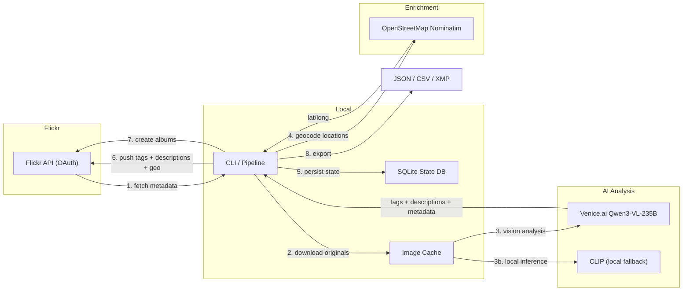

# 🏷️ flickr-autotagger

[](https://github.com/maximusmaximus/flickrtag/actions/workflows/ci.yml)
[](https://opensource.org/licenses/MIT)
[](https://www.python.org/downloads/)

> **AI-powered Flickr photo tagger** — Download all your Flickr photos, analyze them with [Venice.ai](https://venice.ai) vision LLM (Qwen3-VL-235B), auto-tag with rich descriptions, geocode locations, create smart albums, and push everything back to Flickr.

Supports two tagging backends:
- 🧠 **Venice.ai** (recommended) — Cloud vision LLM producing rich tags, descriptions, mood, technique, and location guesses
- 🖥️ **CLIP** (legacy) — Local zero-shot classification with [OpenCLIP](https://github.com/mlfoundations/open_clip)

---

## Architecture



## Features

- 🔬 **Venice.ai Vision Analysis** — Rich structured metadata per photo: title suggestions, 2-3 sentence descriptions, 10-20 tags, scene type, mood, technique, color palette, location guesses, time of day
- 📍 **Auto-Geolocation** — Converts AI location guesses to lat/long coordinates and pushes to Flickr. Your photos appear on Flickr's world map!
- 📁 **Smart Auto-Albums** — Automatically creates Flickr photosets grouped by location and scene type
- 🔄 **Bidirectional Sync** — Push tags, descriptions, titles, and geolocation back to Flickr
- 💾 **Resumable Pipeline** — SQLite state tracking means you can stop and restart anytime
- 📊 **Export** — JSON, CSV, and XMP sidecar formats for Lightroom/Darktable

## Installation

```bash
# Clone the repo
git clone https://github.com/maximusmaximus/flickrtag.git
cd flickrtag

# Install with uv (recommended)
uv pip install -e ".[dev]"

# Or with pip
pip install -e ".[dev]"
```

## Quick Start

```bash
# 1. Copy and edit your environment file
cp .env.example .env
# Edit .env with your Flickr API key/secret and Venice.ai API key

# 2. Authenticate with Flickr (opens browser)
flickr-autotagger auth

# 3. Sync all photo metadata
flickr-autotagger sync

# 4. Download original images
flickr-autotagger download --concurrency 4

# 5. Run Venice.ai vision analysis
flickr-autotagger venice-tag              # Analyze all pending photos
flickr-autotagger venice-tag --limit 50   # Test with 50 photos first

# 6. Geocode location guesses to lat/long
flickr-autotagger geocode

# 7. Push everything back to Flickr
flickr-autotagger venice-push --dry-run          # Preview first
flickr-autotagger venice-push                    # Push tags + descriptions
flickr-autotagger venice-push --update-titles    # Also update photo titles
flickr-autotagger geo-push --dry-run             # Preview geo push
flickr-autotagger geo-push                       # Push lat/long to Flickr map

# 8. Create smart albums
flickr-autotagger auto-albums --dry-run    # See the album plan
flickr-autotagger auto-albums              # Create albums on Flickr

# 9. Export tags
flickr-autotagger export --format json --output tags.json
```

## CLI Reference

| Command | Description |
|---------|-------------|
| `auth` | Authenticate with Flickr via OAuth |
| `sync` | Sync photo metadata from Flickr |
| `download` | Download original images (resumable) |
| `venice-tag` | 🧠 Analyze photos with Venice.ai vision LLM |
| `venice-push` | Push Venice tags + descriptions + titles to Flickr |
| `geocode` | 🌍 Geocode AI location guesses to lat/long |
| `geo-push` | 📍 Push geolocation to Flickr (photos on world map) |
| `auto-albums` | 📁 Create smart albums by location & scene type |
| `tag` | Run CLIP zero-shot tagging (legacy) |
| `review` | Interactively review and approve tags |
| `push` | Push approved tags back to Flickr |
| `export` | Export as JSON, CSV, or XMP sidecar |
| `status` | Show pipeline statistics |

## Venice.ai Analysis Output

Each photo gets a rich structured analysis:

```json
{
  "title_suggestion": "Sunlit Cityscape with Art Deco Tower",
  "description": "This vibrant urban photograph captures a striking contrast between architectural eras under a brilliant blue sky...",
  "tags": ["los angeles", "downtown la", "art deco", "architecture", "cityscape", "sun flare", "blue sky", "urban photography", "california"],
  "objects": ["Los Angeles City Hall", "The Broad museum", "skyscrapers", "trees"],
  "scene_type": "Urban Cityscape",
  "mood": "Bright, Energetic, Dynamic",
  "technique": "Daylight photography with strong backlighting",
  "location_guess": "Downtown Los Angeles, California, USA",
  "time_of_day": "Midday",
  "season_guess": "Late summer",
  "colors": ["Blue", "White", "Beige"]
}
```

## Configuration

All settings are loaded from a `.env` file or environment variables:

| Variable | Default | Description |
|----------|---------|-------------|
| `FLICKR_API_KEY` | *(required)* | Flickr API key |
| `FLICKR_API_SECRET` | *(required)* | Flickr API secret |
| `FLICKR_USER_ID` | *(auto-detected)* | Flickr user NSID |
| `VENICE_API_KEY` | *(required for venice-tag)* | [Venice.ai API key](https://venice.ai/settings/api) |
| `VENICE_MODEL` | `qwen3-vl-235b-a22b` | Venice vision model |
| `TAGGER_BACKEND` | `venice` | `venice` or `clip` |
| `DATA_DIR` | `~/.flickr-autotagger` | Data directory for DB + images |
| `TAG_THRESHOLD` | `0.25` | CLIP confidence threshold |
| `MAX_TAGS_PER_PHOTO` | `15` | Maximum tags per photo (CLIP) |
| `TAG_MERGE_STRATEGY` | `merge` | `merge` (append) or `replace` |

## Cost Estimate

Venice.ai pricing for Qwen3-VL-235B (`~$0.001/photo`):

| Photos | Estimated Cost |
|--------|---------------|
| 100 | ~$0.10 |
| 1,000 | ~$1.00 |
| 10,000 | ~$10.00 |
| 15,000 | ~$15.00 |

Geocoding via OpenStreetMap Nominatim is **free** (no API key needed).

## Contributing

1. Fork the repo
2. Create a feature branch (`git checkout -b feature/amazing`)
3. Install dev dependencies: `uv pip install -e ".[dev]"`
4. Run tests: `pytest`
5. Run linting: `ruff check . && mypy src/`
6. Submit a pull request

## License

[MIT](LICENSE)
