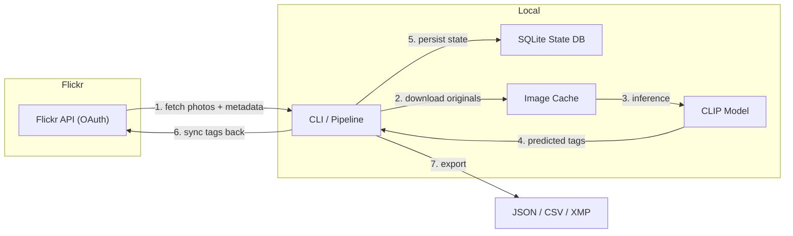

# 🏷️ flickr-autotagger

[](https://github.com/maximusmaximus/flickrtag/actions/workflows/ci.yml)
[](https://opensource.org/licenses/MIT)
[](https://www.python.org/downloads/)

> **AI-powered Flickr photo tagger** — Download all your Flickr photos, auto-tag them with [CLIP](https://openai.com/index/clip/) zero-shot classification running locally, and push the tags back to Flickr.

Your images **never leave your machine**. No cloud APIs, no subscriptions — just local AI inference.

---

## Architecture



## Installation

```bash
# Clone the repo
git clone https://github.com/maximusmaximus/flickrtag.git
cd flickrtag

# Install with uv (recommended)
uv pip install -e ".[dev]"

# Or with pip
pip install -e ".[dev]"
```

## Quick Start

```bash
# 1. Copy and edit your environment file
cp .env.example .env
# Edit .env with your Flickr API key and secret

# 2. Authenticate with Flickr (opens browser)
flickr-autotagger auth

# 3. Sync all photo metadata
flickr-autotagger sync

# 4. Download original images
flickr-autotagger download --concurrency 4

# 5. Run AI tagging
flickr-autotagger tag --threshold 0.25

# 6. Review and approve tags
flickr-autotagger review

# 7. Push approved tags back to Flickr
flickr-autotagger push --dry-run   # Preview first
flickr-autotagger push             # Then push for real

# 8. Export tags
flickr-autotagger export --format json --output tags.json
flickr-autotagger export --format csv --output tags.csv
flickr-autotagger export --format xmp
```

## CLI Reference

| Command | Description |
|---------|-------------|
| `auth` | Authenticate with Flickr via OAuth |
| `sync` | Sync photo metadata from Flickr |
| `download` | Download original images (resumable) |
| `tag` | Run CLIP zero-shot tagging |
| `review` | Interactively review and approve tags |
| `push` | Push approved tags back to Flickr |
| `export` | Export as JSON, CSV, or XMP sidecar |
| `status` | Show pipeline statistics |

## Configuration

All settings are loaded from a `.env` file or environment variables:

| Variable | Default | Description |
|----------|---------|-------------|
| `FLICKR_API_KEY` | *(required)* | Flickr API key |
| `FLICKR_API_SECRET` | *(required)* | Flickr API secret |
| `FLICKR_USER_ID` | *(auto-detected)* | Flickr user NSID |
| `DATA_DIR` | `~/.flickr-autotagger` | Data directory for DB + images |
| `CLIP_MODEL` | `clip-vit-base-patch32` | CLIP model variant |
| `TAG_THRESHOLD` | `0.25` | Minimum confidence threshold |
| `MAX_TAGS_PER_PHOTO` | `15` | Maximum tags per photo |
| `DOWNLOAD_CONCURRENCY` | `4` | Parallel downloads |
| `TAG_MERGE_STRATEGY` | `merge` | `merge` (append) or `replace` |

## How It Works

This tool uses [OpenCLIP](https://github.com/mlfoundations/open_clip) (ViT-B/32) for **zero-shot image classification**:

1. A vocabulary of ~200 candidate tags is provided (landscapes, animals, architecture, etc.)
2. For each image, CLIP computes similarity between the image and each candidate tag
3. Tags above the confidence threshold are stored as predictions
4. You review and approve predictions before they're pushed to Flickr

**Custom tags**: Create a YAML file with your own tags:

```yaml
# custom-tags.yml
tags:
  - urban exploration
  - astrophotography
  - my dog Biscuit
```

Then: `flickr-autotagger tag --custom-tags custom-tags.yml`

## Contributing

1. Fork the repo
2. Create a feature branch (`git checkout -b feature/amazing`)
3. Install dev dependencies: `uv pip install -e ".[dev]"`
4. Run tests: `pytest`
5. Run linting: `ruff check . && mypy src/`
6. Submit a pull request

## License

[MIT](LICENSE)
